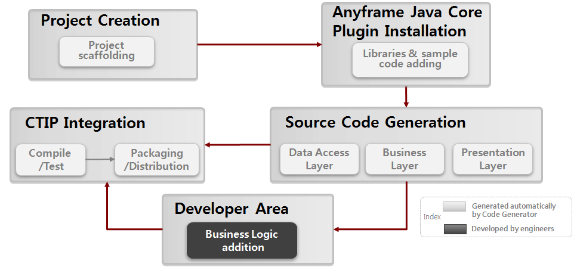

Anyframe Java IDE
====
Anyframe Java IDE는 오픈 소스 기반의 Eclipse Plugin인 **Code Generator**와 **Query Manager**으로 구성된다.

## Code Generator
Anyframe Java IDE Code Generator(이하 Code Generator)는 Anyframe Java Core 기반의 개발 환경을 손쉽게 구성할 수 있도록 템플릿 기반의 프로젝트 구조 및 샘플 코드를 생성하며, Database 기반의 CRUD 코드 생성 기능 등을 지원하는 Eclipse Plugin을 제공하고 있다.

### 특징
Anyframe Java Core 기반으로 프로젝트 수행 시, 개발자들의 개발 편의성을 극대화할 수 있도록 Anyframe Java Core 설치, 프로젝트 생성 및 코드 생성 기능을 포함한 Code Generator를 제공한다. Eclipse Plugin 형태의 Code Generator를 통해 Anyframe Java Core 설치에서부터 프로젝트 구조, 코드 생성, 빌드 수행에 이르기까지 개발 프로세스 전반에 걸쳐 도움을 받을 수 있다.

* 타입별 프로젝트 및 빌드 스크립트 등을 생성한다.
* Domain 클래스를 중심으로 CRUD 기본 코드를 생성하고 테스트 코드와 테스트 데이터를 함께 생성한다.
* Best Practice 에 해당하는 샘플 소스 코드가 생성 됨으로 Anyframe을 활용한 개발 시에 참조 코드로 활용이 용이하다.
* Anyframe Java Core Plugin 목록 조회 및 설치, 제거가 가능해 기능 추가에 따른 추가 리소스 감소에 도움을 준다.

### 주요 기능

#### Creating a new Project
설정된 빌드 타입에 따른 Anyframe Java Core 기반의 프로젝트를 생성을 한다. 생성된 프로젝트를 통해 추후 신규 기능을 추가할 수 있도록 지원한다.

#### Creating All CRUD Classes
Anyframe Java Core 기반으로 Domain 클래스와 Domain 기반으로 CRUD 메소드 중심의 Data Access,Business,Presentation Layer Class를 생성한다. Class는 템플릿 기반으로 생성되며 각 프로젝트 별 개발표준에 맞는 템플릿을 작성하여 반영 할 수 있다.

#### Anyframe Plugin installation
Anyframe Plugin을 Install/Uninstall 하기 위해서 Plugin Installation View를 제공한다. Plugin을 설치하면 해당 Plugin과 연관된 라이브러리가 설치되며, 일부 Plugin의 경우 샘플코드를 제공하고 있다.

#### CTIP Integration
CTIP 서버(Jenkins,Hudson)를 연결하여 CTIP 서버에 job을 등록하고 job을 실행하기 위해서 사용한다. 또한 CTIP 서버의 설정 변경도 가능하다.

### 설치
Code Generator를 설치하여 사용하고자 하기 위해서는 를 통해 진행하는 것을 권장한다. 다만 오프라인으로 설치해야 하는 경우에는 설치 파일(anyframe-ide-X.X.X.zip)을 다운로드 받는다. 이 경우에는 Eclipse에 Update Site를 등록할 경우 다운로드받은 zip 파일을 풀어놓은 위치를 설정하도록 한다.

> Anyframe Java IDE Code Generator 3.1.0은 Anyframe Java Core 5.6.0 이상에서 정상 동작한다.
> Anyframe Java Core 5.5.2나 5.5.1을 사용하기 위해서는 Anyframe Java IDE 3.0.0을 사용하여야 한다.
> 이런 경우 Update Site URL은 http://dev.anyframejava.org/update300 으로 사용하여야 한다.

### 리소스
Code Generator를 개발하기 위해 다음의 오픈소스를 직접적으로 사용하거나 외부 라이브러리로 활용하였다.

## Query Manager
Anyframe Java IDE Query Manager(이하 Query Manager)는 Anyframe의 Query Service를 사용할 때 필요한 데이터베이스 Query문을 관리하고 활용하기 쉽도록 해 주는 Eclipse 플러그인이다.

### 특징
!(README_image/AQM-introduction-concept.jpg)
* Query Explorer를 통해 Query ID의 사용여부 및 중복여부를 쉽게 확인 할 수 있고, Query 맵핑 XML 파일의 전체 Outline을 파악 할 수 있다.
* Query Test Editor를 통해 GUI를 통한 Query 작성 및 테스트/검증 방법을 제공함으로써 Query를 손쉽게 작성할 수 있고, 작성한 Query에 대한 추가적인 테스트 비용을 절감시킨다.
* Query ID의 중복여부 및 사용여부를 검사하여 이상 있는 부분을 화면에 출력한다. 존재하는 Query ID에 대해서는 해당 Query가 존재하는 Query 맵핑 XML 파일과 Java 코드 간의 편리한 네비게이션 기능을 제공한다.
* 사용자의 Eclipse 워크스페이스 내의 수많은 Query를 다양한 옵션으로 검색할 수 있는 기능을 제공하여, Query 관리를 편리하게 해 준다.

Query Manager는 다음과 같은 주요기능을 통해 Anyframe의 Query Service를 사용할 때의 개발 속도 및 생산성 향상을 기대하게 해 준다.

#### Query Manager Perspective
Query Manager는 편리한 Query문 관리를 도와주는 각종 View 및 Context Menu 등을 포함하는 Query Manager Perspective를 제공한다.

* Connections View
* Database Structure View
* Query Explorer View
* Query Results View
* Query Manager Editor
* Query Test Editor
* Preferences
* Properties

#### Managing Query Life-Cycle
Anyframe의 Query Service를 통해 활용하는 다양한 Query문에 대한 생명주기관리(Life-Cycle Management)를 지원한다.

* Anyframe의 Query Service를 사용할 때 활용할 수 있는 Query 맵핑 XML 파일의 손쉬운 작성
* Query Manager Editor 및 Query Explorer, Query Test Editor를 통한 손쉬운 Query 추가/변경/삭제 기능 제공
* 프로젝트 별로 설정된 Query 맵핑 XML의 Outline 및 Query ID의 사용여부, 중복 여부를 설정된 아이콘을 통해 쉽게 파악
* GUI 기반의 Query 작성 지원
* GUI 기반의 Query 테스트 지원
* Query문에 대하여 Query ID의 검색 기능 제공
* Query ID의 중복체크 기능 제공
* Query ID를 기반으로 한 Query문 사용여부 정보 제공
* Anyframe의 Query Service를 활용한 DAO에 대하여 작성한 Query를 손쉽게 활용할 수 있도록 Content Assist 제공
* Query Explorer 와 Query 맵핑 XML 파일 간의 손쉽게 이동할 수 있는 네비게이션 기능 제공
* DAO에서 사용한 특정 Query로 손쉽게 이동할 수 있는 네비게이션 기능 제공

### 설치
Code Generator를 설치하여 사용하고자 하기 위해서는 를 통해 진행하는 것을 권장한다. 다만 오프라인으로 설치해야 하는 경우에는 설치 파일(anyframe-ide-X.X.X.zip)을 다운로드 받는다. 이 경우에는 Eclipse에 Update Site를 등록할 경우 다운로드받은 zip 파일을 풀어놓은 위치를 설정하도록 한다.

#### 리소스
Query Manager를 개발하기 위해 다음의 오픈소스를 직접적으로 사용하거나 외부 라이브러리로 활용하였다.

